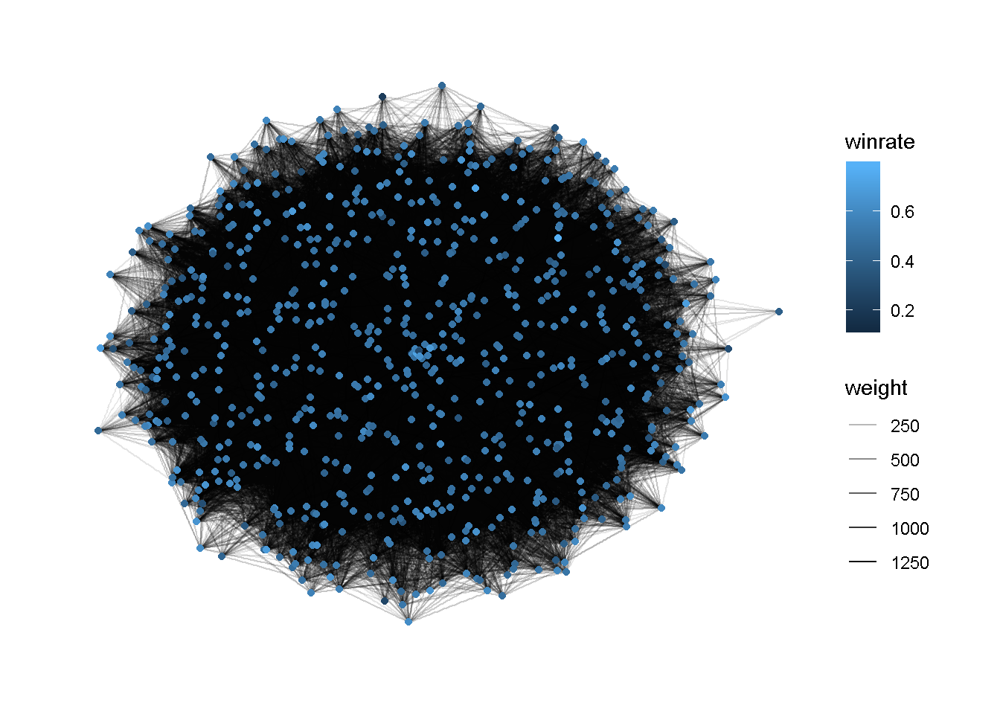

<style>
  .col2 {
    columns: 2 200px;         /* number of columns and width in pixels*/
    -webkit-columns: 2 200px; /* chrome, safari */
    -moz-columns: 2 200px;    /* firefox */
  }
  .col3 {
    columns: 3 100px;
    -webkit-columns: 3 100px;
    -moz-columns: 3 100px;
  }
  
  .shiny-input-panel {
    border: 0px;
    background: white;
    display: flex;
    justify-content: space-between;
  }

  .shiny-input-checkboxgroup.shiny-input-container-inline label ~ .shiny-options-group, .shiny-input-radiogroup.shiny-input-container-inline label ~ .shiny-options-group {
    margin-top: -1px;
    margin-left: auto;
    margin-right: auto;
    width: 800px !important;
  }
  .irs{
    width: 800px !important;
  }
</style>

```{r setup, include=FALSE}
knitr::opts_chunk$set(echo = FALSE)
library(tidyverse)
library(igraph)
library(ggraph)
library(corrplot)
# per caricare
#library(rsconnect)
#rsconnect::deployApp('applicazione.Rmd')

# per stampe e filtri vari
classi <- c("Druid",
            "Hunter",
            "Mage",
            "Paladin",
            "Priest",
            "Rogue",
            "Shaman",
            "Warlock",
            "Warrior")

# is_game_card <- function(id){return(regexpr(".*GAME.*",id)>0)}
# is_hero_card <- function(id){return(regexpr(".*HERO.*",id)>0)}
# is_grHP_card <- function(id){return(regexpr("AT_.*_",id)>0)}
carte_da_escludere <- c("The Coin", "AFK"    , 
      "Shapeshift"      , "Dire Shapeshift"  ,"Malfurion Stormrage" , "Lunara"             ,
      "Steady Shot"     , "Ballista Shot"    ,"Rexxar"              , "Alleria Windrunner" ,
      "Fireblast"       , "Fireblast Rank 2" ,"Jaina Proudmoore"    , "Khadgar"            , "Medivh",
      "Reinforce"       , "The Silver Hand"  ,"Uther Lightbringer"  , "Lady Liadrin"       , "Prince Arthas",
      "Lesser Heal"     , "Heal"             ,"Anduin Wrynn"        , "Tyrande Whisperwind",
      "Dagger Mastery"  , "Poisoned Dagger", "Poisoned Daggers" ,"Valeera Sanguinar"   , "Maiev Shadowsong"   ,
      "Totemic Call"    , "Totemic Slam"     ,"Thrall"              , "Morgl the Oracle"   ,
      "Life Tap"        , "Soul Tap"         ,"Gul'dan"             , "Nemsy Necrofizzle"  , "Mecha-Jaraxxus",
      "Armor Up!"       , "Tank Up!"         ,"Garrosh Hellscream"  , "Magni Bronzebeard"       
      )

colori <- c("Druid"="brown", 
            "Hunter"="green", 
            "Mage"="aquamarine",
            "Paladin"="yellow",
            "Priest"="grey",
            "Rogue"="black",
            "Shaman"="blue",
            "Warlock"="blueviolet",
            "Warrior"="red")

icone <- c(
  "https://hsreplay.net/static/images/class-icons/druid.png",
  "https://hsreplay.net/static/images/class-icons/hunter.png",
  "https://hsreplay.net/static/images/class-icons/mage.png",
  "https://hsreplay.net/static/images/class-icons/paladin.png",
  "https://hsreplay.net/static/images/class-icons/priest.png",
  "https://hsreplay.net/static/images/class-icons/rogue.png",
  "https://hsreplay.net/static/images/class-icons/shaman.png",
  "https://hsreplay.net/static/images/class-icons/warlock.png",
  "https://hsreplay.net/static/images/class-icons/warrior.png"
)
load_games <- Sys.time()
# dataset delle partite fatte
dataset_games <- read_csv("dataset/games.csv")
load_games <- Sys.time() - load_games

# preferisco:
# 1: spaccare data e ora
# 2: mettere il risultato della partita come un booleano
# 3: trasformo il rank in un valore intero
dataframe_games <- Sys.time()
games <- dataset_games %>%
  mutate(period = as.Date(added,format = "%Y-%m") ) %>%
  mutate(result = if_else(result=="win", TRUE, FALSE)) %>%
  mutate(coin = if_else(coin=="true", TRUE, FALSE)) %>%
  transform(rank = as.numeric(rank))%>%
  transform(legend = as.numeric(legend))%>%
  select(everything() , -added)
dataframe_games <- Sys.time() - dataframe_games


load_plays <- Sys.time()
# dataset delle giocate fatte in ogni partita
dataset_plays <- read_csv("dataset/plays1.csv")
load_plays <- Sys.time() - load_plays

filtered_plays<-dataset_plays
#dataframe_plays <- Sys.time()
#plays <- dataset_plays %>%
#  filter(turn > 0 & !(name %in% carte_da_escludere)) %>%
#  transform(mana = as.numeric(mana))%>%
#  mutate(mana = if_else(is.na(mana), 0, mana)) %>%
#  left_join(games , by = c("game_id"="id"))%>%
#  select(game_id, period, player, turn, card_id, name, mana)
#dataframe_plays <- Sys.time() - dataframe_plays

# periodo di validità del dataset
start <- (games %>%
  select(period) %>%
  group_by(period) %>%
  arrange(period) %>%
  head(1) )[[1]]

end <- (games %>%
  select(period) %>%
  group_by(period) %>%
  arrange(desc(period)) %>%
  head(1))[[1]]

#dataframe_filtered_plays <- Sys.time()
#filtered_plays <- plays %>%
#    left_join(games%>%select(id,result,rank,legend), by = c("game_id"="id"))%>%
#    mutate(result = if_else(player=="opponent",!result,result))%>%
#    filter(period>=(end-120))%>%
    #filter(rank<=5 | legend>0)%>%
  # prendo solo quelle carte che sono state giocate almeno 100 volte
#    group_by(name,card_id)%>%
#    filter(n()>100)
#dataframe_filtered_plays <- Sys.time() - dataframe_filtered_plays

#wrong_data = filtered_plays %>% 
#  group_by(game_id,player,turn) %>% 
#  summarise(mana_spent = sum(mana))%>%
#  arrange(mana_spent) %>% 
#  filter(mana_spent>16) %>%
#  ungroup()%>% 
#  select(game_id)

#filtered_plays1 <- filtered_plays %>%
#  anti_join(wrong_data, by ="game_id")
#write_csv(filtered_plays1,"dataset/plays1.csv")

nodes <- filtered_plays %>%
  group_by(name)%>%
  summarize(avg_turn = mean(turn), 
            mana=mean(mana),
            winrate=sum(result)/n())%>%#-1/log(sum(result)/n()) )%>% # -1/log(0.8) > -1/log(0.5) > -1/log(0.3)
  ungroup()%>%
  select(name,mana,avg_turn,winrate)%>%
  arrange(avg_turn)


# dataframe_edges <- Sys.time()
#queste sono per la prima iterazione
# old_me <- "fake"
# old_op <- "fake"
# 
# total <- length(filtered_plays$game_id)
# total_edges <- 1
# # card network construction
# card_name1 <- array(dim=total)
# card_name2 <- array(dim=total)
# for( i in (2:total)){
#   row1 <- filtered_plays[i-1, ]
#   row2 <- filtered_plays[i  , ]
#   # se sono due giocate successive della stessa partita le lego tra loro
#   if (row1$game_id == row2$game_id) {
#     if (row1$player == row2$player) {
#       # se sono due giocate dello stesso giocatore
#       card_name1[total_edges]<- row1$name
#       card_name2[total_edges]<- row2$name
#     } else if (row1$player == "me"){
#       if (old_me=="fake"){ old_me <- row2$name }
#       else{
#         card_name1[total_edges]<- old_me
#         card_name2[total_edges]<- row2$name
#         old_me                   <- row2$name
#       }
#     } else if (row1$player == "opponent"){
#       if (old_op=="fake"){ old_op <- row2$name }
#       else{
#         card_name1[total_edges]<- old_op
#         card_name2[total_edges]<- row2$name
#         old_op                 <- row2$name
#       }
#     }
#     total_edges <- total_edges + 1
#   }
# }
# 
# edges <- tibble(
#   card_1 = card_name1,
#   card_2 = card_name2)

# tengo conto di quante volte viene fatta la stessa giocata
# edges <- edges %>%
#   filter(!is.na(card_1) & !is.na(card_2))%>%
#   group_by(card_1,card_2)%>%
#   summarize(weight = n())%>%
#   arrange(weight)
#dataframe_edges <- Sys.time() - dataframe_edges
#write_csv(edges,"dataset/edges.csv")
edges <- read_csv("dataset/edges.csv")

# controlliamo che sia tutto apposto
#temp <- edges %>%
# anti_join(nodes , by = c("card_1"="name")) %>%
# anti_join(nodes , by = c("card_2"="name"))

#create_network <- Sys.time()
g = graph_from_data_frame(edges, directed = TRUE, vertices = nodes)
#create_network <- Sys.time() - create_network


filter_by_date <- function(ds,range ){
return( ds %>%
          filter(
            between(as.Date(period,"%Y-%m"),
                    as.Date(range[1],"%Y-%m"),
                    as.Date(range[2],"%Y-%m")
                    ) 
          )
      )
}
filter_by_class <- function(ds,selector){
  # se non ho selezionato una classe le ritorno tutte
  if (is.null(selector) ){ return(ds) }
  # seleziono solo le classi scelte
  return( ds %>%
    filter( class %in% selector )
  )
}

top <- function(list,n){
  return( head(sort(list, decreasing = TRUE),n) )
}

#load_games
#dataframe_games
#load_plays
#dataframe_plays
#dataframe_filtered_plays
#dataframe_nodes
#dataframe_edges
#create_network
```

## Introduction
In this presentation we will analize the card game Hearthsone.
- We will see how the "meta" has changed through the years, which classes have been played the most and we will try to figure out why they haev been played.
- After that, there will be an analysis of each single card used in the game not only the frequency of usage during time but also we will try to figure out how a single card can have an impact on the game.

All the data are available [here](http://www.hearthscry.com/). Here we have loaded data from `r start` to `r end`.

## First analysis
Let's prepare the data. From the game dataset we want to know how much it is worth to play a class rather than another. So we compute the winrate of a class for each day, then we will display it in a way that you can analyze how it has changed over time.
Given that also our opponent is playing a specific class we have to compute also his winrate and then summarize the two result.

```{r class winrate computation, echo=TRUE}
# class winrate
class_analysis <-( games %>%
                group_by(hero, period) %>%
                summarize(wins = sum(result), games = n()) %>%
                rename(class = hero) %>%
                ungroup() ) %>%
  left_join(
    ( games %>%
      group_by(opponent, period) %>%
      summarize(wins = sum(result), games = n()) %>%
      rename(class = opponent) %>%
      ungroup() )
      , by = c("class", "period")) %>%
  group_by(class, period) %>%
  summarize(wins = wins.x+wins.y, games = games.x+games.y, winrate = wins/games)
```

Here we have an example of the resulting data of the last day. Unfortunately, not so many players report their result in the last period of analysis :( .
```{r class winrate table view, echo=FALSE}
class_analysis$class <- as.factor(class_analysis$class)
# vediamo i dati
knitr::kable(
  class_analysis %>% filter(period == end), 
  caption = "Class winrate over time"
)
```

## Let's look to the winrate over time {#title .emphasized }

You can select one or more classes (if none there will be displayed all).
```{r}
inputPanel(
  checkboxGroupInput("class_selector", "Classes",
    choiceNames = mapply(classi, icone, FUN = function(classe, iconeUrl) {
      tagList(
        tags$img(src=iconeUrl, width=50, height=50),
        ""
      )
    }, SIMPLIFY = FALSE, USE.NAMES = FALSE),
    choiceValues = classi,
    inline = TRUE
  ),
  textOutput("txt")
)
```
And select a specific period of time to analyze.
```{r}
inputPanel(
#Add a Slider Input to select date range
  sliderInput(inputId = "Date_range_selector",
              label ="Select Date Range",
              min = start,
              max = end,
              value = c(start,end),
              step = 30,
              timeFormat="%Y-%m")
)
```   
 
```{r plot card analysis}
renderPlot({
  class_analysis %>%
    filter_by_date(input$Date_range_selector)%>%
      filter_by_class(input$class_selector) %>%
  ggplot(aes(x = period, y = winrate)) + 
    geom_smooth(aes(color = factor(class)), se = FALSE) +
    scale_color_manual( values = colori)+
    theme_minimal()
})
```
So, this is the winrate for each class that we have computed ... but this is not tellig us a lot.
In the next step we'll try to find out why a specific class has that winrate in that period.

## Presence on the game {#title .emphasized }
First of all we want to know if the number of player that use a specific class can influence the meta. So we plot the number of games per class.

```{r presence computation, echo=TRUE}
class_analysis <- class_analysis %>%
  group_by(period) %>%
  mutate(total_games_per_day = sum(games)) %>%
  ungroup() %>%
  mutate(presence = games/total_games_per_day)

# vediamo i dati
knitr::kable(
  class_analysis %>% filter(period == end) %>% select(everything(),-wins, -winrate), 
  caption = "Class winrate over time"
)
```

As before, We can select one or more classes (if none there will be displayed all) and a specific period of time.
    
```{r}
inputPanel(
  checkboxGroupInput("presence_class_selector", "Classes",
    choiceNames = mapply(classi, icone, FUN = function(classe, iconeUrl) {
      tagList(
        tags$img(src=iconeUrl, width=50, height=50),
        ""
      )
    }, SIMPLIFY = FALSE, USE.NAMES = FALSE),
    choiceValues = classi,
    inline = TRUE
  )
)

inputPanel(
#Add a Slider Input to select date range
  sliderInput(inputId = "presence_Date_range_selector",
              label ="Select Date Range",
              min = start,
              max = end,
              value = c(start,end),
              step = 30,
              timeFormat="%Y-%m")
)
```

```{r presence plot}
renderPlot({
  class_analysis %>%
    filter_by_date(input$presence_Date_range_selector)%>%
      filter_by_class(input$presence_class_selector)%>%
  ggplot(aes(x = period, y = presence)) + 
    geom_smooth(aes(color = factor(class)), se = FALSE) +
    scale_color_manual( values = colori) +
    theme_minimal()
})
```
What is the correlation between the number of player that are using a specific class and his winrate?

```{r}
inputPanel(
#Add a Slider Input to select date range
  sliderInput(inputId = "correlation_Date_range_selector",
              label ="Select Date Range",
              min = start,
              max = end,
              value = c(start,end),
              step = 30,
              timeFormat="%Y-%m")
)
``` 

```{r correlation presence winrate plot}
renderPlot({
  class_analysis %>%
    filter_by_date(input$correlation_Date_range_selector)%>%
    mutate(total_games_period_selected = sum(games))%>%
    group_by(class,total_games_period_selected)%>%
    summarize(games_per_period = sum(games),
              wins_per_period  = sum(wins))%>%
    # quante partite registrate di quella classe sul totale delle partite di tutte le classi
    mutate(presence_per_period = games_per_period/total_games_period_selected,
    # quante vittorie registrate di quella classe sul totale delle partite di quella classe
              winrate_per_period = wins_per_period/games_per_period) %>%
    select(class, wins_per_period,games_per_period,presence_per_period,winrate_per_period)%>%

    # plot dei risultati
    ggplot(aes(x = presence_per_period, y = winrate_per_period)) +  
    geom_point(aes(color = factor(class), size = 16*winrate_per_period, stroke = 5)) +
    scale_color_manual( values = colori)+
    ylim(0.3 ,0.75) + 
    xlim(0.  ,0.3) +
    theme_minimal()
})
```

This seems not really helpful. I really expected that an higher winrate class would be played more that a lower winrate class. 

## Winrate filtered on high ranks {#title .emphasized }
The phenomenon here is what i call "il calcetto del giovedì sera" (that literraly is translated to "the football match of Thursday evening") where people that spend all the week sitted on the couch watching tv improvise to be top football players (with questionable results).
But Hearthstone players, luckily, are divided in ranks, from 50 to 0 (the 0 rank is called *legend*). So if we focus only on high ranks? I expect that at least there players play not only for fun but also to try to win as most as possible.
```{r class winrate computation with rank, include=FALSE}
# class winrate
class_total_rank <- ( games %>%
                      filter(rank <=5 | legend > 0 ) %>%
                      group_by(hero, period) %>%
                      summarize(wins = sum(result), games = n()) %>%
                      rename(class = hero) %>%
                      ungroup()
                    ) %>%
  left_join(
    ( games %>%
      filter(rank <=5 | legend > 0 ) %>%
      group_by(opponent, period) %>%
      summarize(wins = sum(result), games = n()) %>%
      rename(class = opponent) %>%
      ungroup()
    ), by = c("class", "period")) %>%
  group_by(class, period) %>%
  summarize(wins = wins.x+wins.y, games = games.x+games.y, winrate = wins/games) %>%
  ungroup()

# vediamo i dati
knitr::kable(
  class_total_rank %>% filter(period == end) %>% select(everything(),-wins, -winrate), 
  caption = "Class winrate over time"
)
```
As before, we can focus on a specific period of time and on a specific class.
```{r rank input}
inputPanel(
  checkboxGroupInput("rank_class_selector", "Classes",
    choiceNames = mapply(classi, icone, FUN = function(classe, iconeUrl) {
      tagList(
        tags$img(src=iconeUrl, width=50, height=50),
        ""
      )
    }, SIMPLIFY = FALSE, USE.NAMES = FALSE),
    choiceValues = classi,
    inline = TRUE
  )
)

inputPanel(
#Add a Slider Input to select date range
  sliderInput(inputId = "rank_Date_range_selector",
             label ="Select Date Range",
             min = start,
             max = end,
             value = c(start,end),
             step = 30,
             timeFormat="%Y-%m")
)
``` 

```{r rank winrate plot}
renderPlot({
  class_total_rank %>%
    filter_by_date(input$rank_Date_range_selector)%>%
      filter_by_class(input$rank_class_selector)%>%
        ggplot(aes(x = period, y = winrate)) + 
          geom_smooth(aes(color = factor(class)), se = FALSE) +
            scale_color_manual( values = colori) +
              theme_minimal()
})
```

Does we have any changes looking to the correlation between the number of player that are using a specific class and his winrate?

```{r}
inputPanel(
#Add a Slider Input to select date range
  sliderInput(inputId = "rank_correlation_Date_range_selector",
              label ="Select Date Range",
              min = start,
              max = end,
              value = c(start,end),
              step = 30,
              timeFormat="%Y-%m")
)
``` 

```{r rank correlation presence winrate plot}
renderPlot({
  class_total_rank %>%
    filter_by_date(input$rank_correlation_Date_range_selector)%>%
    mutate(total_games_period_selected = sum(games,  na.rm = TRUE))%>%
    group_by(class,total_games_period_selected)%>%
    summarize(games_per_period = sum(games,  na.rm = TRUE),
              wins_per_period  = sum(wins ,  na.rm = TRUE))%>%
    # quante partite registrate di quella classe sul totale delle partite di tutte le classi
    mutate(presence_per_period = games_per_period/total_games_period_selected,
    # quante vittorie registrate di quella classe sul totale delle partite di quella classe
           winrate_per_period  = wins_per_period/games_per_period) %>%
    select(class, wins_per_period,games_per_period,presence_per_period,winrate_per_period)%>%
  
    # plot dei risultati
    ggplot(aes(x = presence_per_period, y = winrate_per_period),show.legend = FALSE) +  
    geom_point(aes(color = factor(class), size = 16*winrate_per_period, stroke = 5),show.legend = FALSE) +
    scale_color_manual( values = colori)+
    ylim(0.3 ,0.75) + 
    xlim(0.  ,0.3) +
    theme_minimal()
})
```

As you can see, there is the same effect as before but here is less visible.

## Correlation between classes
Let's analyze the correlation between the winrate of different classes and see if we can understand somenthing more from the information about the presence of those classes in the game

```{r class correlation computation, include=FALSE}
winrate_correlation <- class_analysis %>% select(period)

winrate_correlation <- class_analysis  %>% 
  filter(class=="Druid") %>%
  right_join(winrate_correlation, by = "period") %>%
  mutate("Druid winrate" = if_else(is.na(winrate), 0, winrate)) %>%
  select(period, `Druid winrate`)
  
winrate_correlation <- class_analysis  %>% 
  filter(class=="Priest") %>%
  right_join(winrate_correlation, by = "period") %>%
  mutate("Priest winrate" = if_else(is.na(winrate), 0, winrate)) %>%
  select(period, `Druid winrate`, `Priest winrate`)

winrate_correlation <- class_analysis  %>% 
  filter(class=="Rogue") %>%
  right_join(winrate_correlation, by = "period") %>%
  mutate("Rogue winrate" = if_else(is.na(winrate), 0, winrate)) %>%
  select(period, `Druid winrate`, `Priest winrate`, `Rogue winrate`)

winrate_correlation <- class_analysis  %>% 
  filter(class=="Mage") %>%
  right_join(winrate_correlation, by = "period") %>%
  mutate("Mage winrate" = if_else(is.na(winrate), 0, winrate)) %>%
  select(period, `Druid winrate`, `Priest winrate`, `Rogue winrate`, `Mage winrate`)

winrate_correlation <- class_analysis  %>% 
  filter(class=="Shaman") %>%
  right_join(winrate_correlation, by = "period") %>%
  mutate("Shaman winrate" = if_else(is.na(winrate), 0, winrate)) %>%
  select(period, `Druid winrate`, `Priest winrate`, `Shaman winrate`, `Rogue winrate`, `Mage winrate`)

winrate_correlation <- class_analysis  %>% 
  filter(class=="Warlock") %>%
  right_join(winrate_correlation, by = "period") %>%
  mutate("Warlock winrate" = if_else(is.na(winrate), 0, winrate)) %>%
  select(period, `Druid winrate`, `Priest winrate`, `Shaman winrate`, `Rogue winrate`, `Mage winrate`, `Warlock winrate`)

winrate_correlation <- class_analysis  %>% 
  filter(class=="Warrior") %>%
  right_join(winrate_correlation, by = "period") %>%
  mutate("Warrior winrate" = if_else(is.na(winrate), 0, winrate)) %>%
  select(period, `Druid winrate`, `Priest winrate`, `Shaman winrate`, `Rogue winrate`, `Mage winrate`, `Warlock winrate`, `Warrior winrate`)

winrate_correlation <- class_analysis  %>% 
  filter(class=="Paladin") %>%
  right_join(winrate_correlation, by = "period") %>%
  mutate("Paladin winrate" = if_else(is.na(winrate), 0, winrate)) %>%
  select(period, `Druid winrate`, `Priest winrate`, `Shaman winrate`, `Rogue winrate`, `Mage winrate`, `Warlock winrate`, `Warrior winrate`, `Paladin winrate`)

winrate_correlation <- class_analysis  %>% 
  filter(class=="Hunter") %>%
  right_join(winrate_correlation, by = "period") %>%
  mutate("Hunter winrate" = if_else(is.na(winrate), 0, winrate)) %>%
  select(period, `Druid winrate`, `Priest winrate`, `Shaman winrate`, `Rogue winrate`, `Mage winrate`, `Warlock winrate`, `Warrior winrate`, `Paladin winrate`, `Hunter winrate`)

# vediamo i dati
knitr::kable(
  head(winrate_correlation,10), 
  caption = "Class winrate over time"
)
```

```{r}
inputPanel(
#Add a Slider Input to select date range
  sliderInput(inputId = "class_correlation_Date_range_selector",
              label ="Select Date Range",
              min = start,
              max = end,
              value = c(start,end),
              step = 30,
              timeFormat="%Y-%m")
)
```

```{r class correlation plot}
renderPlot({
  corrplot(
    cor(winrate_correlation %>%
        filter_by_date(input$class_correlation_Date_range_selector)%>%
        select(everything(), -period),
        use="all.obs",
        method="pearson")
    , method = "ellipse"
    , type = "upper")
})
```

## Card Analysis
Here tha analysis of the cards is done only for the last months of data because the creation of the network which cover all the data is really slow (on my latop over 30 minuts).

```{r card network plotting, out.width='100%'}
plot_network <- Sys.time()

# ggraph(g, layout = "with_kk" ) + 
#   geom_edge_link(aes(alpha = weight)) + # edge link geom, mapping alpha to weight
#   geom_node_point(aes(color = winrate)) +     # node point geom, mapping size to pagerank centrality
#   theme_graph(base_family="sans")
#load.image("img/card network plotting-1.png")

plot_network <- Sys.time() - plot_network
```

Let's analyze this network!!
First of all I want to find out if play a card "on curve" (it means playing it on the first possible turn) it is woth or not. This is the distribution of the cards played. 
```{r play on curve, include=FALSE}
summary(nodes$avg_turn-nodes$mana)    
ggplot(nodes, aes(x=avg_turn-mana, stat(density)), title("Density of cards played on curve")) +
  geom_histogram(binwidth=1.5, alpha=0.25) +
  geom_density(color="blue", size=1)+ 
  theme_minimal()
```

We can see that most of the players tend to play cards at most one turn later of optimal play, does this influence the overall winrate?
```{r winrate on curve, include=FALSE}
ggplot(nodes%>%filter(avg_turn-mana>-1),aes(x = avg_turn-mana, y = winrate)) + 
    geom_point(aes(alpha=avg_turn-mana))+
    geom_smooth(se = TRUE) +
    theme_minimal()
```

So, after this small introduction we can start to ask ourself more interesting questions like: which are the most versatile cards? They are such cards which lies in lot of path (games).
```{r betweenness}
belli = top(betweenness(g),12)
knitr::kable(
  belli, 
  caption = "Most versatile cards (using betweenness)"
)
```

Another kind of versatility analysis.
```{r page rank}
belli = top(page_rank(g, directed = TRUE, weights = edges$weight)$vector,10)
knitr::kable(
  belli, 
  caption = "Most versatile cards (using pagerank)"
)
```

```{r similarity, eval=FALSE, include=FALSE}
#When we have to build a deck and we miss a card...which are the best replacements? 

A <- as_adjacency_matrix(g, attr = g$weight, name=FALSE)
A
S <- cor(as.matrix(A))
diag(S) <- 0
D <- 1-S
d <- as.dist(D)
cc <- hclust(d, method="average")
S[2,]
D[1,]
```

Which are the cards which have a big impact in the game?

```{r power}
forti = top(power_centrality(g),12)
knitr::kable(
  belli, 
  caption = "Most important cards (using power)"
)
```

But usually, a card is not played alone. Can we identify combos? Which are the most played combination of cards
```{r combos}
knitr::kable(
  head(edges %>% arrange(-weight),12), 
  caption = "Most played combination of cards"
)
```

We can define a **good play** if playing that card in that situation increase the average winrate. Can we identify such good plays?

```{r good_plays}
giocate_corrette <- nodes %>%
  left_join(edges, by = c("name" = "card_1")) %>%
  left_join(nodes, by = c("card_2" = "name")) %>%
  filter(winrate.x < winrate.y, winrate.x>0, mana.x<mana.y)%>%
  select(name, mana.x, winrate.x, card_2, mana.y,winrate.y, weight)%>%
  distinct()

knitr::kable(
  head(giocate_corrette %>% arrange(-(winrate.y-winrate.x)*weight),12), 
  caption = "Most important cards (using power)"
)

giocate_molto_forti <- giocate_corrette %>%
  left_join(edges, by = c("card_2"="card_1")) %>%
  left_join(nodes, by = c("card_2.y"="name")) %>%
  filter(winrate.y < winrate, mana.y<mana) %>%
  select(name,card_2,card_2.y,winrate.x,winrate.y,winrate)%>%
  distinct()
```

In this analysis we miss (unfortunately) the archetypes data (which kind of deck is been used). This would allow us to better understand the similarity between cards and the importance of a card in a specific archetype.